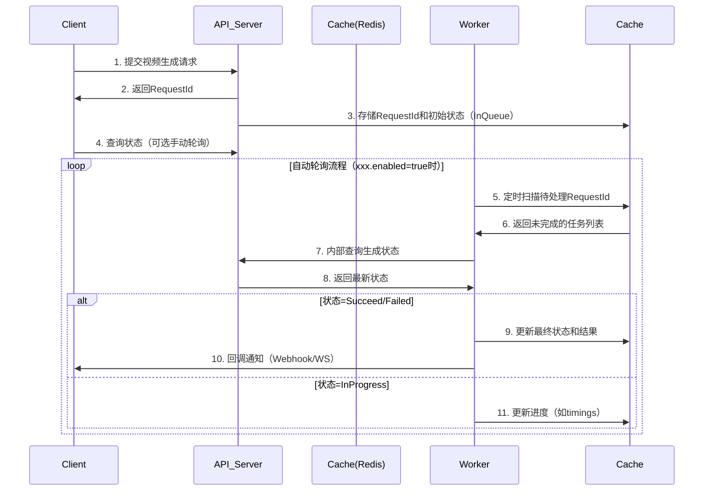

# spring-ai-video-extision
> 来源：飞书文档 https://dcn7850oahi9.feishu.cn/docx/DDehdPBMSoGTycxmFTLcER4In0F?from=from_copylink

---

## 📌 SpringAI 视频生成模型自定义集成仓库说明

### 1. 背景
- **SpringAI 1.0.0 正式版** 暂未提供 **视频生成模型** 的官方抽象与实现。
- 本仓库**完全遵循 SpringAI 顶层抽象架构**，参考：
  - `ChatClient` 的 **会话记忆设计模式**
  - `OpenAI` 厂商实现类的 **结构风格**
- 在 OpenAI 实现基础上 **简化底层 Api 类**：
  - **去除冗余 Request 封装类**
  - **减少一次深拷贝**
  - **字段扩展更直观**

---

### 2. 流程设计


---

### 2. 目录结构

```
custom
├─ api
│  └─ VideoApi.java
├─ client
│  └─ VideoClient.java
├─ model
│  ├─ VideoModel.java
│  ├─ impl
│  │  └─ VideoModelImpl.java
│  ├─ request
│  │  └─ VideoPrompt.java
│  └─ response
│     ├─ VideoResponse.java
│     └─ VideoResult.java
├─ option
│  ├─ VideoOptions.java
│  └─ impl
│     └─ VideoOptionsImpl.java
├─ storage
│  ├─ VideoStorage.java
│  ├─ VideoStorageStatus.java
│  └─ impl
│     └─ InMemoryVideoStorage.java
└─ trimer
   ├─ VideoTimer.java
   ├─ config
   │  └─ VideoTimerConfig.java
   ├─ enums
   │  └─ VideoStorageStatus.java
   └─ response
      └─ VideoScanResponse.java
```

---

### 3. 配置项总表

| Key | 说明 | 默认值 | 示例 |
|-----|------|--------|------|
| `ai.video.timer.enabled` | 是否启用轮询定时任务 | `true` | `false` |
| `ai.video.timer.timeout` | 任务超时时间（ms） | `300000`（5 min） | `600000` |
| `ai.video.timer.ttl` | 任务存储 TTL（ms） | `86400000`（24 h） | `3600000` |
| `ai.video.timer.interval` | 轮询间隔（ms） | `30000`（30 s） | `10000` |
| `ai.video.timer.key-prefix` | 存储 key 前缀 | `in:memory:key` | `video:task:` |

---

### 4. 单元测试类

```java
package com.ai.springaidemo02.ai.video.custom;

import com.ai.springaidemo02.ai.video.custom.api.VideoApi;
import com.ai.springaidemo02.ai.video.custom.client.VideoClient;
import com.ai.springaidemo02.ai.video.custom.model.impl.VideoModelImpl;
import com.ai.springaidemo02.ai.video.custom.option.impl.VideoOptionsImpl;
import com.ai.springaidemo02.ai.video.custom.request.VideoPrompt;
import com.ai.springaidemo02.ai.video.custom.response.VideoResponse;
import com.ai.springaidemo02.ai.video.custom.storage.impl.InMemoryVideoStorage;
import org.junit.jupiter.api.Test;
import org.springframework.boot.test.context.SpringBootTest;

@SpringBootTest
class CustomVideoModelTest {

    @Test
    void contextLoads() {
        // 1. 构建选项
        VideoOptionsImpl options = VideoOptionsImpl.builder()
                .prompt("一只柯基在沙滩奔跑")
                .model("Wan-AI/Wan2.2-T2V-A14B")
                .negativePrompt("模糊,低质量")
                .build();

        // 2. 构建 Api
        VideoApi videoApi = VideoApi.builder()
                .apiKey("s-********************fa")
                .baseUrl("https://api.siliconflow.cn")
                .videoPath("v1/video/submit")
                .build();

        // 3. 构建 Model & Client
        VideoModelImpl videoModel = new VideoModelImpl(videoApi);
        VideoClient videoClient = new VideoClient(videoModel, new InMemoryVideoStorage());

        // 4. 调用
        String requestId = videoClient.param()
                .prompt("一只柯基在沙滩奔跑")
                .model("Wan-AI/Wan2.2-T2V-A14B")
                .negativePrompt("模糊,低质量")
                .getOutput();

        System.out.println("requestId = " + requestId);
    }
}
```

---

### 5. 快速开始

1. 改配置 → 2. 换 key → 3. 跑测试 → 4. 拿 `requestId` → 5. 等轮询完成 → 6. 拿视频地址！

### 6. 后续规划

1. v1.1.0	配置文件驱动·视频模型集群	 🚧 开发中
